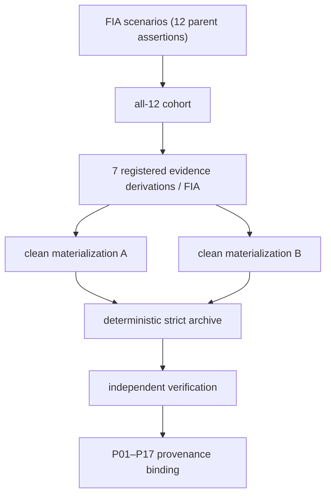
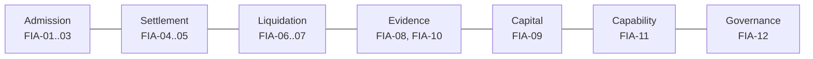

# Axient FIA

Reproducibility and evidence companion for the Axient research programme on
leveraged event markets.

| | |
| --- | --- |
| Financial Interaction Assertions | 12 |
| Retained evidence-layer positions | 84 |
| Byte-identical clean materializations | 2 |
| Deterministic independently verified archive | 1 |
| Provenance replay | P01–P17 |

Phase 17B completed a reproducible evidence chain for twelve correlated
Financial Interaction Assertions, comprising 84 retained evidence-layer
positions with registered derivations, two byte-identical clean
materializations, a deterministic strict archive accepted by a separate
verifier, and a selected P01–P17 replay whose final output is content-bound to
that archive.



## Overview

This repository is a compact, public research companion. It preserves the
canonical identifiers, registries, schemas, descriptions, and an offline
verifier needed to inspect the Phase 17B evidence chain. It is deliberately
not a mirror of the internal engineering workspace, runtime corpus, raw
traces, or operational evidence store.

## Research programme

All research papers below are by Maksym Nechepurenko. The list uses one title,
publication-status, and PDF format throughout.

| Paper | Publication status | PDF |
| --- | --- | --- |
| *Axient: Debt-Free Finality for Leveraged Binary Event Markets* | r0.4.2; [arXiv:2608.00631](https://arxiv.org/abs/2608.00631); DOI: [10.48550/arXiv.2608.00631](https://doi.org/10.48550/arXiv.2608.00631) | [PDF](papers/downloads/Axient_Debt_Free_Finality_r0.4.2_SHORT.pdf) |
| *Axient: On-Chain Credit and Loss Allocation for Leveraged Event Markets: A Venue-Agnostic Protocol for Traders, Credit Providers, Market Makers, and Liquidation Backstops* | r0.4.1; [arXiv:2608.00647](https://arxiv.org/abs/2608.00647); DOI: [10.48550/arXiv.2608.00647](https://doi.org/10.48550/arXiv.2608.00647) | [PDF](papers/downloads/Axient_On_Chain_Credit_and_Loss_Allocation_r0.4.1_SHORT.pdf) |
| *Axient: Empirical Calibration of Venue-Agnostic Event-Margin Protocols: A Prospectively Frozen Analysis Plan, Deterministic Internal-Alpha Technical Pilot, and Venue-Emulator Methodology* | r0.6.0; [SSRN:7216083](https://ssrn.com/abstract=7216083); DOI: [10.2139/ssrn.7216083](https://doi.org/10.2139/ssrn.7216083) | [PDF](papers/downloads/Axient_Empirical_Calibration_r0.6.0_SHORT.pdf) |
| *AEMB: A Deterministic Cross-Language Verification Benchmark for Event-Margin Protocols* | [SSRN:7216198](https://ssrn.com/abstract=7216198); DOI: [10.2139/ssrn.7216198](https://doi.org/10.2139/ssrn.7216198) | [PDF](papers/downloads/AEMB_Benchmark_15p.pdf) |
| *AVET: A Provenance-Aware Venue Emulator Trace Dataset for Event Markets* | [SSRN:7216180](https://ssrn.com/abstract=7216180); DOI: [10.2139/ssrn.7216180](https://doi.org/10.2139/ssrn.7216180) | [PDF](papers/downloads/AVET_Dataset_15p.pdf) |
| *Axient: Canonical Protocol-Graph Composition for Leveraged Event Markets* | r0.5.1; PDF available; arXiv: forthcoming; SSRN: forthcoming | [PDF](papers/downloads/Axient_Paper_IV_Canonical_Protocol_Graph_r0.5.1.pdf) |
| *Axient: Manifest-Bound End-to-End Evidence for On-Chain Financial Protocols* | r0.5.1; PDF available; arXiv: forthcoming; SSRN: forthcoming | [PDF](papers/downloads/Axient_Paper_V_Manifest_Bound_E2E_Evidence_r0.5.1.pdf) |
| *AEMB: Canonical Protocol-Graph End-to-End Conformance for Hybrid Financial Protocols* | r0.5.1; PDF available; arXiv: forthcoming; SSRN: forthcoming | [PDF](papers/downloads/AEMB_v0.2_Cohort_Bound_Conformance_r0.5.1.pdf) |

Each PDF is an unchanged author-provided copy. SHA-256 values are recorded in
[SHA256SUMS](SHA256SUMS); see [papers/](papers/) for the publication map.

The AEMB v0.2 article is distinct from the earlier AEMB v0.1.0 article with
SSRN DOI `10.2139/ssrn.7216198`. The v0.2 dataset/schema freeze remains
`HOLD` pending a separate frozen-package review.

## Phase 17B result

The canonical all-12 result is recorded in
[evidence/phase17b-summary.json](evidence/phase17b-summary.json):

- run: `phase17b-run-4c40d373b9c4ead91ecfdcab5539941743733b06`
- all-12 manifest SHA-256:
  `342b2a6f27aeb91bba2013f5604ab1c50aaba48d6f218c3f3f84cc5c39ce7bfd`
- ledger root SHA-256:
  `09cd709444eb82a0c2c17d4b42a2750b2cd9b6002f69b6a3648c4e2ea1b41e46`
- strict archive SHA-256:
  `6901e3277c49693c867f1d960166acfb5dddb76eaf134b4bf66fba26e54cf328`
- P01–P17 coordinator result SHA-256:
  `2e51296ab1d50558342a9e740f94ddf3e5e7d221c1b329466577a7918bb0767f`
- P17 final output SHA-256:
  `111a9c6c2848d6605081f4fcf08dfd859a51423e1478a50d2c252c49fa6cda1b`

## FIA-01…FIA-12



The scenario registry is [evidence/scenario-registry.csv](evidence/scenario-registry.csv).
Detailed, citable assertion definitions are under [fia/](fia/). FIA-11 has
two mandatory subcases, FIA-011A and FIA-011B, but remains one parent
assertion: the denominator is always 12, never 14.

## Evidence architecture

Each of the twelve parent assertions has seven **retained evidence layers with
registered derivations**. The public registry records 84 positions and the
parent/scenario identity for each one. The scope distinction between what the
repository recomputes and what it attests from withheld runtime payload is in
[VERIFICATION_SCOPE.md](VERIFICATION_SCOPE.md).

- [all-12 cohort metadata](evidence/all12-manifest.json)
- [scenario registry](evidence/scenario-registry.csv)
- [evidence-layer registry](evidence/evidence-layer-registry.csv)
- [schemas](schemas/)

## Provenance architecture and P01–P17 replay

The selected sequential replay has 17 ordered phase results. P17 is
content-bound to the deterministic strict archive. The machine-readable record
is [evidence/p01-p17-replay-manifest.json](evidence/p01-p17-replay-manifest.json);
the explanatory index is [provenance/P01-P17.md](provenance/P01-P17.md).

## AEMB

[AEMB v0.2](benchmark/aemb-v0.2/) is documented as a standalone benchmark
publication, with its supplied short version available for download in
[papers/downloads/](papers/downloads/). The Phase 17B materials publish the
benchmark-facing definitions and reproducibility interface.

## Reproduce / verify

```bash
git clone https://github.com/AxientLab/axient-fia-public.git
cd axient-fia-public
node verifier/verify.mjs
```

The verifier requires no network and no private repository. It recomputes
integrity checks over published files: parent count, unique correlations, seven
registered layer positions per FIA, FIA-11 subcase completeness,
materialization/package/replay metadata, publication PDF checksums, and
[SHA256SUMS](SHA256SUMS). Runtime-payload identities are explicitly attested,
not reconstructed, as described in [VERIFICATION_SCOPE.md](VERIFICATION_SCOPE.md).

## Repository structure

- [papers/](papers/) — publication map and stable metadata placeholders.
- [fia/](fia/) — twelve parent assertions and special boundaries.
- [evidence/](evidence/) — machine-readable result records.
- [provenance/](provenance/) — selected replay and claim registry.
- [benchmark/](benchmark/) — AEMB v0.2 public definitions.
- [schemas/](schemas/) — public metadata schemas.
- [verifier/](verifier/) — standalone integrity verifier.

## Claim boundaries

The repository publishes a reproducible evidence record and its registered
derivations. It does not publish secrets, raw logs/traces, runtime dumps,
personal data, credentials, operating-system paths, partner data, or internal
infrastructure configuration. Nor does the published record itself assert an
external production outcome or terminal settlement. Those assertions require a
separate evidence programme and are not inferred from this artefact.

## Citation

See [CITATION.cff](CITATION.cff). Cite the repository release/commit together
with the exact manifest, root, archive, and replay identifiers used.

## Licence

See the directory-level multi-licence [policy](LICENSE_POLICY.md). Axient
names and marks are excluded from the grants; see [TRADEMARK.md](TRADEMARK.md).

## Security

See [SECURITY.md](SECURITY.md). Do not report sensitive information in public
issues.
